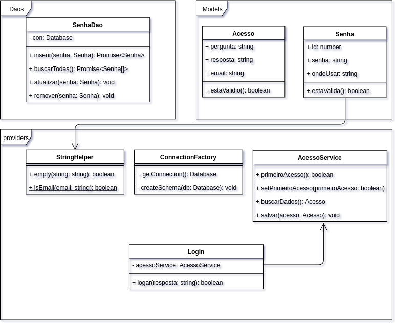
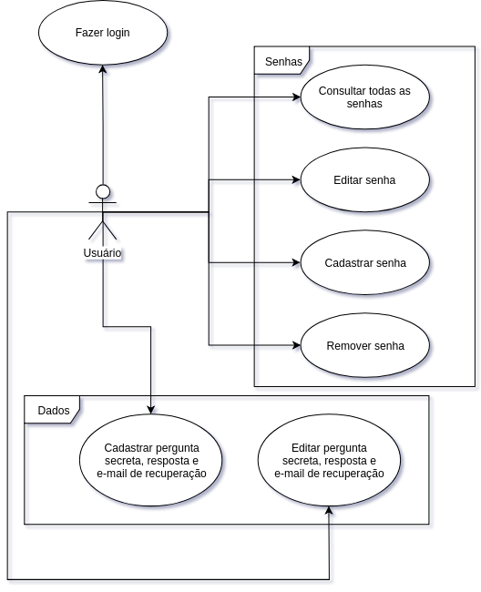
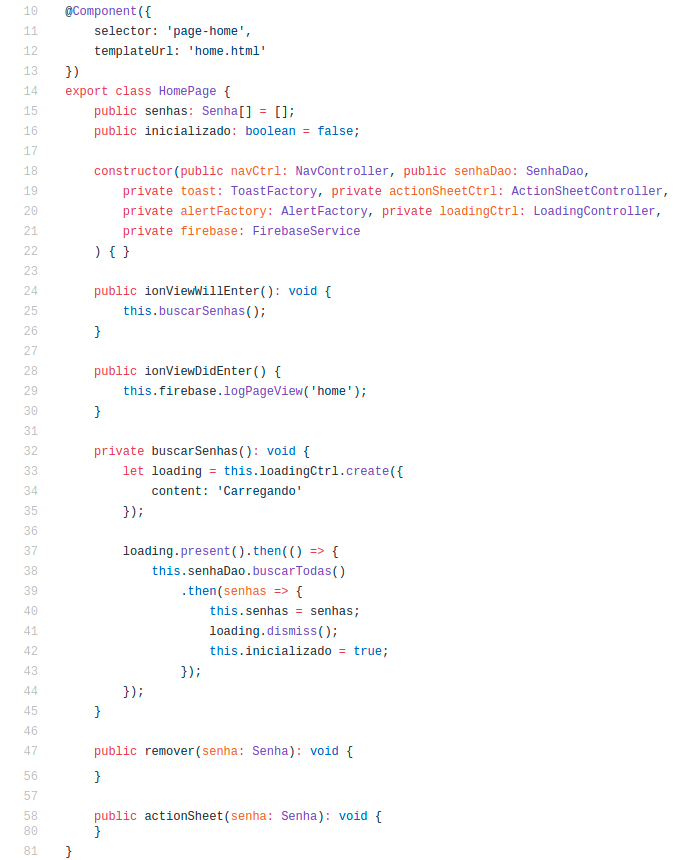
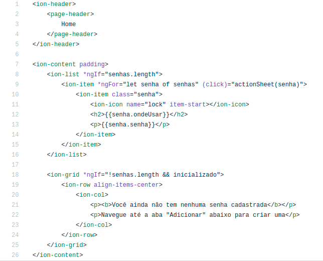

# Introdução

Como citado no resumo, precisamos de muitas senhas para diversos serviços, que podem (e devem) ser alteradas com certa frequência.

Lembrar-se de todas é um grande desafio, e segundo aponta uma pesquisa realizada pela empresa _Intel Security_, pelo menos um terço de usuários da internet esquece uma de suas senhas pelo menos uma vez por semana \cite{pesquisa_esquecer_senhas}.

Segundo os dados desta pesquisa, a maioria dos usuários não utiliza nenhum programa especial para armazenar suas senhas, o que colabora para este alto índice de esquecimento.

Ainda segundo esta pesquisa, muitas vezes os usuários utilizam a mesma senha para acessar diversos serviços, o que vai contra recomendações e oferece risco para a segurança de suas informações.

Uma simples solução para mitigar este problema do esquecimento, possibilitando que os usuários utilizassem diversas senhas, seria o uso de programas que organizem suas senhas, permitindo uma eventual consulta.

# Soluções Disponíveis

## Aplicativos existentes

Felizmente já existem aplicações que oferecem esta funcionalidade de armazenar suas senhas. Sejam estas soluções online, ou até aplicativos móveis para _smartphones_.

Algumas aplicativos que realizam este trabalho são:

- Dashlane \cite{dashlane}
- RoboForm \cite{roboform}
- LastPass \cite{lastpass}
- 1Password \cite{1password}
- Keeper \cite{keeper}

Porém, um ponto em comum destes softwares é que todos transmitem suas senhas pela internet (mesmo que encripatadas). Um usuário malicioso pode obter acesso aos seus dados e tentar decifrá-los, conseguindo assim, acesso a todas as contas cujas senhas estivessem armazenadas no _App_.

## Aplicativo _Esqueci a senha!_ \cite{esqueci_a_senha}

Com uma proposta diferente, foi desenvolvido o aplicativo _Esqueci a senha!_ \cite{esqueci_a_senha}, tendo algumas vantagens e desvantagens quando comparado às soluções supracitadas.

O principal diferencial é que _Esqueci a senha!_ \cite{esqueci_a_senha} armazena suas senhas somente em um banco de dados no próprio celular, não transmitindo nada pela internet. Com isso, você ganha em segurança, perdendo em praticidade. As senhas só existirão em um dispositivo, e serão perdidas em caso de troca de aparelho, por exemplo.

Além disso, o aplicativo tem seu acesso protegido por uma "pergunta secreta" que o usuário deve definir em seu primeiro acesso ao mesmo. Desta forma, caso alguém ache o celular, não conseguirá acessar suas senhas, mas não será necessária **mais uma senha** para acessar o aplicativo.

# Escopo do projeto

## Descrição da aplicação

Para que a utilização seja simples e direta, o aplicativo armazena apenas 2 campos para cada senha:

- Onde usar;
- Senha.

Desta forma, não há necessidade de exibir vários campos que muitas vezes não seriam utilizados, sem perder a flexibilidade, sendo o campo "Onde usar" textual, em que o usuário pode escrever inclusive seu login, caso seja necessário.

Já a "pergunta secreta" citada no capítulo anterior, funciona da seguinte maneira:

Um aplicativo que armazena senhas, deve ter algum tipo de proteção, para o caso do aparelho ir parar em mãos de terceiros.
Além disso, um usuário que faz uso deste tipo de aplicativo tende a esquecer suas senhas, logo, não seria interessante para o mesmo que o programa fosse protegido com uma outra senha, já que seria comum o esquecimento desta também.
Para isso, foi implementado o mecanismo em que o usuário no primeiro acesso à aplicação, define uma pergunta da qual apenas ele deveria saber a resposta, e a resposta desta. Assim, a cada acesso subsequente, a pergunta seria exibida, sendo necessário digitar a resposta.

## Aplicação híbrida

Pensando na portabilidade entre plataformas, ou seja, na possibilidade de executar o aplicativo tanto em sistemas Android quanto iOS, o aplicativo foi desenvolvido de forma híbrida, combinando características do desenvolvimento Web e Nativo.

Este modelo ainda é bastante utilizado e foi um grande impulsionador do que hoje conhecemos como PWA.

Ele funciona da seguinte forma: Toda a aplicação é desenvolvida utilizando as tecnologias Web, ou seja, HTML, CSS e JS. Desta forma, toda a interface e principais funcionalidades do aplicativo são criadas. Faz-se uso de alguma ferramenta que envolva esta aplicação Web, de forma que gere um arquivo instalável em dispositivos móveis, o qual poderá ser enviado para as lojas (Play Store da Google e App Store da Apple).

Este tipo de ferramenta cria um aplicativo nativo, contendo um componente chamado de _WebView_, que tem como propósito exibir páginas da Web. Este componente é carregado com nossa aplicação Web sendo executada em tela cheia, o que dá a sensação de ser nativo. Além disso, algumas ferramentas ainda fornecem _plugins_ para algumas funcionalidades nativas, como acesso a contatos, arquivos, etc.

# Tecnologias utilizadas

## Cordova \cite{cordova}

A ferramenta utilizada para desenvolver a solução de forma híbrida foi o _Apache Cordova_, que é a mais conhecida e difundida no meio.

Desenvolvido por uma empresa chamada _Nitobi_ e comparada pela _Adobe Systems_ em 2011, o projeto se chamava _PhoneGap_. Logo após a compra, uma versão de código aberto do software foi lançada, recebendo o nome _Apache Cordova_ devido à sua licença (Apache License \cite{apache_license}).

Os plugins utilizados foram os seguintes:

- cordova-plugin-device: Plugin que fornece acesso a um objeto global `device`, que permite acesso a informações do dispositivo, como modelo, plataforma, versão, etc;
- cordova-plugin-firebase-analytics: Plugin que permite o envio de informações para o _Firebase Analytics_, que monitora o acesso a cada tela;
- cordova-plugin-splashscreen: Plugin que permite a exibição de uma _SplashScreen_ (tela com a logo do projeto) antes da execução do aplicativo;
- cordova-plugin-whitelist: Plugin que, dentre outras coisas, libera acesso do aplicativo à internet;
- ionic-plugin-keyboard: Plugin que faz com que a aplicação web se comporte como nativa, não se alterando com a abertura do teclado em campos de digitação.

## Ionic \cite{ionic}

O _Apache Cordova_ não fornece nenhum tipo de interface personalizada para que desenvolvamos nossa aplicação de forma semelhante às aplicações nativas. Todo este trabalho deveria ser feito através de códigos CSS.

Para facilitar esta tarefa, existe um projeto chamado _Ionic Framework_, que fornece componentes prontos que se adaptam à plataforma utilizada, ou seja, o visual do aplicativo no Android e no iOS fica ligeiramente diferente, se parecendo com um aplicativo nativo de cada plataforma, mesmo tendo sido escrito apenas uma base de código.

Este projeto faz uso de um framework JavaScript chamado _Angular_.

## Angular \cite{angular}

O framework Angular foi criado pela Google, e tem como principal característica a possibilidade de criação de componentes, que podem ser estilizados de forma independente, e utilizados dentro de outros componentes.

Utilizando Angular, o Ionic consegue criar componentes estilizados, e fazendo uso do plugin `cordova-plugin-device`, consegue formatar os mesmos de acordo com a plataforma utilizada, ou seja, oferecer aparências diferentes para Android e iOS, por exemplo.

## Web SQL Database

Devido à simplicidade dos dados armazenados, não foi necessária uma grande análise sobre a melhor forma de armazená-los, logo, um simples banco de dados relacional foi utilizado devido à maior familiaridade com este tipo de tecnologia.

O banco de dados relacional utilizado na Web é chamado de _Web SQL Database_, e fornece funcionalidades simples como criação e manipulação de tabelas, o que foi suficiente para o projeto.

# Apresentação do _Esqueci a Senha!_

## Arquitetura do projeto

### Padrão arquitetural

O projeto foi organizado estruturalmente, de forma com que uma classe é responsável por exibir a tela, enquanto outra é responsável por realizar ações e fornecer serviços, sendo outra responsável por representar os dados da aplicação. Para seguir esta linha, foi utilizado um padrão arquitetural chamado de MVC. A classe que identifica qual tela será exibida, é chamada de _Controller_. O arquivo (neste caso, em html) que define a parte visual da tela, é chamado de _View_, enquanto a classe que representa um dado, como uma senha, por exemplo, é chamado de _Model_.

O padrão MVC é amplamente adotado em aplicações Web atualmente, o que torna fácil o entendimento do projeto por demais desenvolvedores familiarizados com tal ambiente.

### Diretórios de arquivos

- app/
    - Pasta que contém o componente inicial da aplicação, que decide se a tela de login ou tela de cadastro da pergunta secreta será exibida
- assets/
    - Pasta de imagens, onde estão contidos os ícones da aplicação
- components/
    - Pasta que contém componentes compartilhados entre telas, como o cabeçalho, botões, etc.
- daos/
    - Pasta que contém os arquivos que fazem aceso aos dados, no caso, ao Web SQL Database
- models/
    - Pasta que contém a definição das classes de negócio
- pages/
    - Pasta que contém a definição das telas do aplicativo
- providers/
    - Pasta que contém definição de classes utilizadas nas páginas, que fornecem algum tipo de serviço, como criar conexão com o banco, criar alertas para a tela, etc.
- theme/
    - Pasta que contém o arquivo com o esquema de cores do aplicativo
- declarations.d.ts
    - Arquivo que contém a definição de tipos desconhecidos pelo TypeScript
- index.html
    - Arquivo principal do aplicativo, que exibe o componente inicial
- manifest.json
    - Arquivo contendo dados da aplicação para que possa ser utilizado como PWA
- service-worker.js
    - Arquivo que realiaria tarefas em segundo plano, caso necessário

## Diagramas

### Diagrama de classes

As principais classes de negócio, e classes fornecedoras de serviços que usam, ou são usadas nas classes de negócios estão descritas no diagrama de classes.

{#diagrama-classes largura=100%}

Fonte: Autor.

Ver \autoref{diagrama-classes}

### Diagrama de caso de uso

As funções mais comuns do aplicativo são descritas no diagrama de casos de uso.

{#casos-uso largura=100%}

Fonte: Autor.

Ver \autoref{casos-uso}

## Exemplos de código

Para exemplificar como é o código de uma tela, pode ser conferido o exemplo do componente TS, ou seja, o _Controller_. Nele, temos alguns métodos do ciclo de vida do componente, como `ionViewWillEnter`, executado antes da tela ser carregada, e `ionViewDidEnter`, executado após entrar na tela. Nestes métodos podem ser executadas algumas ações, como buscar os dados a serem exibidos, realizar logs, enviar dados estatísticos, etc.

{#pagina-home-ts largura=100%}

Fonte: Autor.

Ver \autoref{pagina-home-ts}

Já para mostrar o template, ou seja, a _View_ de uma tela, podemos ver o código em HTML. Nele, podemos acessar todos os métodos públicos do _Controller_, e assim, recuperar dados para exibí-los.

{#pagina-home-html largura=100%}

Fonte: Autor

Ver \autoref{pagina-home-html}